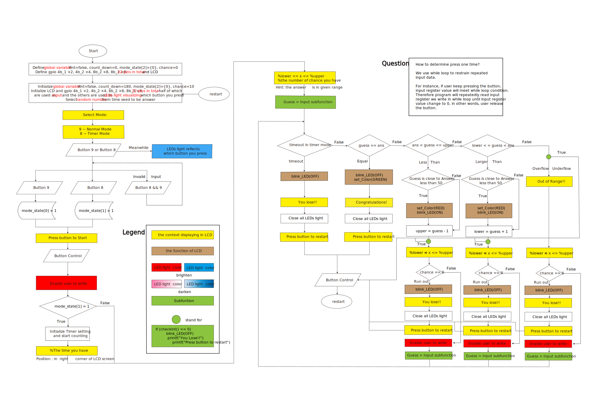
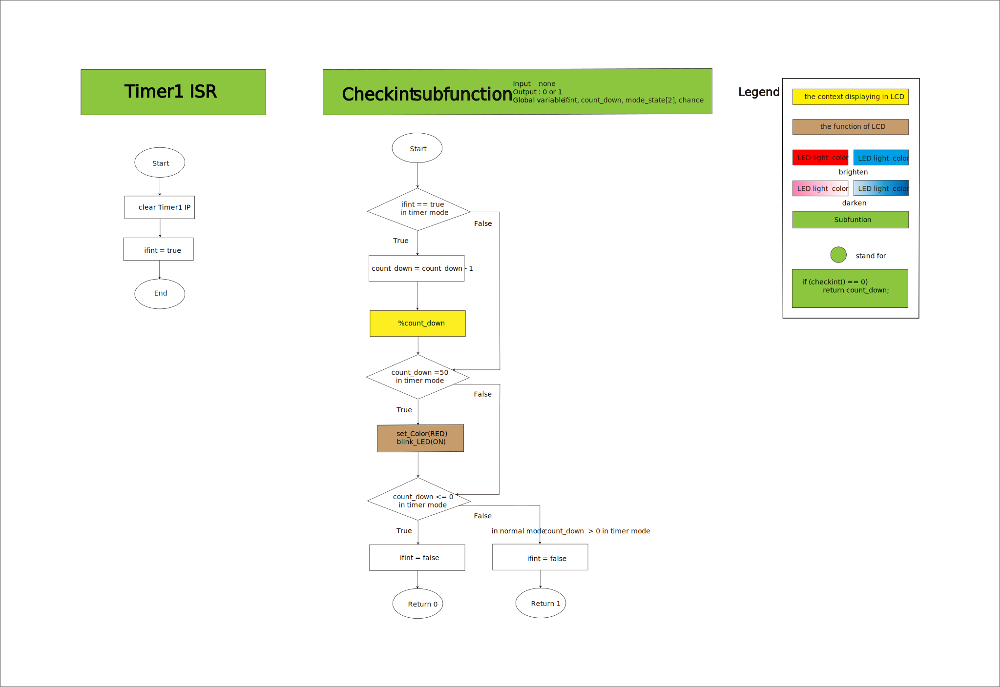

# Guess The Nunber
##### Final Project of Computer Organization
Time : 2020 fall (first half semester of sophomore)

## Youtube demo clip
[](https://www.youtube.com/watch?v=LY89O8TjXG8)

<br>

## lecture

|subject|teacher|
|:-:|:-:|
|[計算機組織](http://class-qry.acad.ncku.edu.tw/syllabus/online_display.php?syear=0109&sem=1&co_no=E221700&class_code=2)|[陳中和](https://caslab.ee.ncku.edu.tw/)|

<br>

## Environment
as same as [Computer Organization lec06-lec07](https://github.com/HsuChiChen/computer-organization)

1. OS
- `Windows 10`
2. Software
- `GNU Toolchain`
- `Putty`
- `Zadig` (USB Driver Adjustment)
3. Hardware
- `ARC　IoTDK`
- `some module`
    - 按鈕開關×11
    - 藍色LED×10
    - 紅色LED×1
    - 杜邦線×(4∙12)
    - 電阻×11
    - LCD模組
    - ARC IoTDK板子

<br>

## How to Run
1. download repo
```
git clone https://github.com/HsuChiChen/guess-the-nunber.git
```
2. Connect PC & IoTDK (dataport)
3. Check COM Port Number in “Device Manager”
4. Open Putty
5. Click Serial
6. Key in your COM Port Number
7. Set Speed to 115200
8. Click Open
9. make run
```
make run
```

<br>

## 實驗動機
利用我們上實驗課所學`ARC IoTDK`的基本功能，其中包括
- Lab6-1按鈕觸發LED的亮暗
- Lab6-2用來計時的裝置timer
- Lab7-2LCD模組的顯示

等功能，設計一款大家可能都玩過的團康遊戲「終極密碼」。

<br>

## 操作說明
終極密碼規則:其中一人做莊，給定一個數字範圍，再從中選出一個自然數，此數字稱為「密碼」，不能讓其他參與遊戲者得知。而遊戲參與者輪流猜測數字。每猜一個數，莊家就要告知遊戲者該數字是大於或小於密碼，直至密碼被猜中。

<br>

## 程式流程圖




<br>

## 程式分析
主要可以分成四個部分
1. Global variable
2. Main function(初始化+無限迴圈組成)
3. Input function
4. Timer function (checkint+isr組成)

### Global variable
在這邊放的是會在不只一個地方用到的變數。
- `lcd_obj`: LCD的物件(Main, Input, checkint)
- `ifint`: 表示有沒有進過Interrupt(isr, checkint)
- `count_down`: 表示剩餘的秒數(Main, Input, checkint)
- `chance`: 表示剩餘可以猜的次數(Main, Input)
- `mode_state[2]`: 表示現在是什麼模式(Main, checkint)

### Main function
- **初始化**:<br>
分成在無限迴圈內跟外。
    - 外:get GPIOs object跟設定pin腳的狀態還有初始化IIC 0
    - 內:一些在restart之後需重設的變數

- **無限迴圈**:<br>
最外層的是為了實作restart。
在其中有一些接在吃按鈕input後面的是拿來卡住的，如果按鈕持續被按著的話就會無法跳出迴圈。
<br><br>
若當前為Timer Mode會初始化Timer1跟印出開始的秒數，接著會顯示初始範圍跟總共可以猜幾次。
<br><br>
再來就開始猜並將結果回傳給guess。
<br><br>
接下來的無限迴圈是根據回傳的值印出不同的文字到LCD上並繼續遊戲，或是印出You Lose!!或Congratulations!並跳出迴圈等待restart。
<br><br>
在迴圈的各個if中會穿插`checkint()`來看是否剩餘秒數為0。

### Input function
進去先把燈都初始化為暗，然後進while迴圈開始讓user去輸入想猜多少並印出來到LCD上。按一下按鈕`guess`會加那個按鈕代表的值，再按一下則會再扣回來。
<br><br>
決定好要猜什麼後，按下Control按鈕跳出迴圈並把`chance – 1`，如果`chance`為3的話就把LCD設為紅色閃爍最後再把`guess`回傳。
在function中的各個位置也會放上`checkint()`來查看是否剩餘秒數為0。

### Timer function
在`isr`中只會將`IP clear`跟`ifint`設為`true`，代表有進中斷。
在`checkint`中如果是Timer Mode且`ifint == true`的話，會把秒數減一並印在LCD的右下角。數到剩50秒的話會將LCD設為紅色閃爍，數到剩0秒的話會將`ifint`設回`false`並回傳0，其餘狀況的話一樣會將`ifint`設回`false`但回傳`1`。